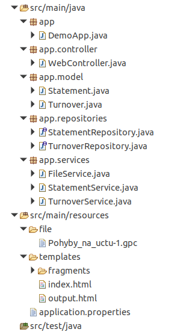

## Assignment

This project is simple demonstration that 

- Loads gpc file from local storage
- Reads the file content
- Parse the file and map to corresponding object
- Displays(list) the on the output window
- And saves to MongoDB

## Requirement

- Spring boot
- MongoDB
- Eclipse IDE

## Project file structure

Have five different packages: app (application starting point), controller, models, repositories, services.

In resource folder there is a folder called ***file*** in my case i used this folder to store gpc file. and also ***templates*** folder html files.

## Reference

I have used a documentation for ***gpc*** file format from FIO bank website and the link id below

https://www.fio.cz/docs/cz/API_Bankovnictvi.pdf

Originally the documentation was on Czech language 

[here]: gpc-file-documentation.docx	"Translated GPC file Documentation"

 is the translated that i have used.