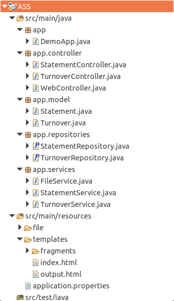

# Assignment

This project is simple demonstration that 

- Loads gpc file from local storage
- Reads the file content
- Parse the file and map to corresponding object
- Displays(list) the on the output window
- And saves to MongoDB

Project file structure

